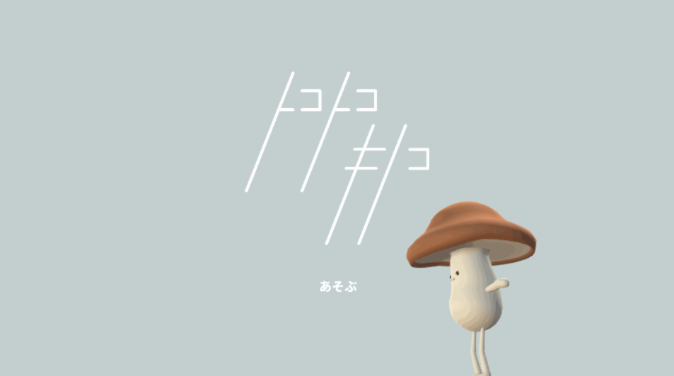

# トコトコキノコ

2019年03月11日~17日に開催されていた[Unity 1週間ゲームジャム](https://unityroom.com/unity1weeks) | [お題「つながる」](https://unityroom.com/unity1weeks/12) で制作したパズルゲーム「トコトコキノコ」のソースコード

[こちら](https://unityroom.com/games/tocotoco)でプレイできます

## 使い方

- プロジェクトを開いて `App/Main.unity` を開く
- ゲームには下記の素材を使用させていただておりますが、リポジトリにデータが含まれていません。別途ダウンロードしてプロジェクトにインポートする必要があります。

## 素材

- DOTween (HOTween v2) https://www.assetstore.unity3d.com/#!/content/27676
  - アセットストアからインポートして `Setup DOTween...` をクリック
- NotoSans https://www.google.com/get/noto/help/cjk/
  - Canvas以下のテキストコンポーネントの`Missing (Font)`となっている部分にフォントを適用
- 効果音ラボ https://soundeffect-lab.info/
  - `Scripits -> Sound Manager` の `Missing (Audio Clip)`となっている部分にオーディオを適用
